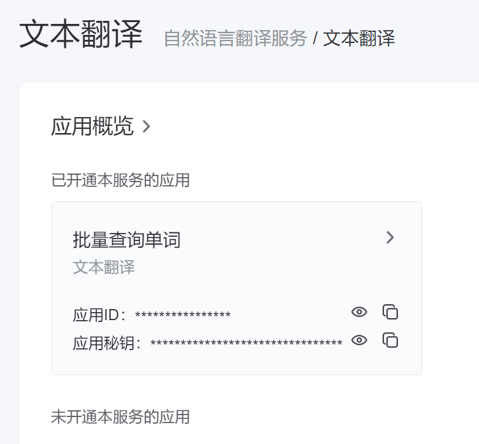
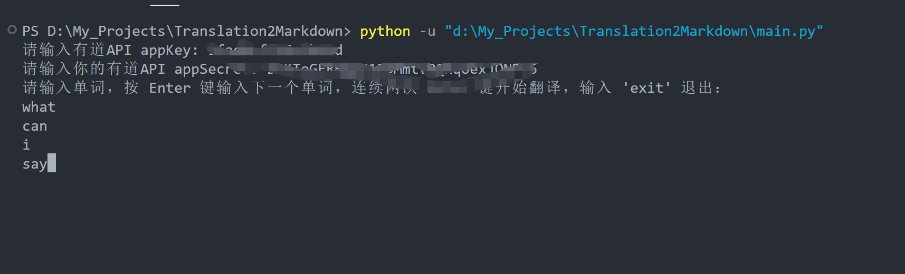
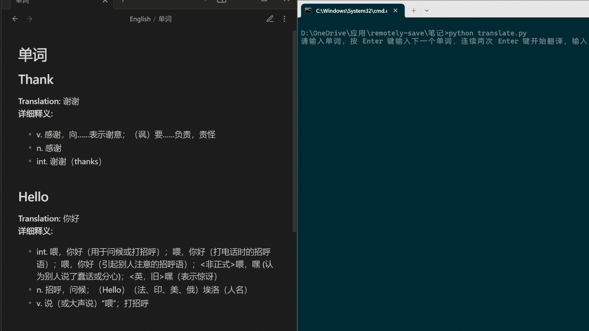

# 翻译脚本使用说明

## 简介

这是一个使用有道翻译 API 的 Python 脚本，可以将输入的英文单词翻译成中文，并将翻译结果保存到一个 Markdown 文件中。适合自己学习，批量查询单词时使用，提高效率

## 依赖项

在运行此脚本之前，请确保已安装以下 Python 包：

- `requests`
- `beautifulsoup4`

你可以通过以下命令安装这些依赖项：

```sh
pip install requests beautifulsoup4
```

## 配置

首次运行脚本时，你需要输入有道翻译 API 的 [`app_key`](vscode-file://vscode-app/d:/c++/Microsoft%20VS%20Code/resources/app/out/vs/code/electron-sandbox/workbench/workbench.html "Go to definition") 和 [`app_secret`](vscode-file://vscode-app/d:/c++/Microsoft%20VS%20Code/resources/app/out/vs/code/electron-sandbox/workbench/workbench.html "Go to definition")。这些信息会被保存到 `config.json` 文件中，以便后续使用。有道翻译API申请地址https://ai.youdao.com/,会有60元体验，完全足够，平均30词0.01元。



## 使用方法

1. 将脚本保存为 [`translate.py`](vscode-file://vscode-app/d:/c++/Microsoft%20VS%20Code/resources/app/out/vs/code/electron-sandbox/workbench/workbench.html "d:\OneDrive\应用\remotely-save\笔记\translate.py")。
2. 在终端中运行脚本：

   **python** **translate.py**
3. 按提示输入要翻译的单词，每输入一个单词后按 [`Enter`](vscode-file://vscode-app/d:/c++/Microsoft%20VS%20Code/resources/app/out/vs/code/electron-sandbox/workbench/workbench.html "Go to definition") 键。连续按两次 [`Enter`](vscode-file://vscode-app/d:/c++/Microsoft%20VS%20Code/resources/app/out/vs/code/electron-sandbox/workbench/workbench.html "Go to definition") 键开始翻译。
4. 输入 [`exit`](vscode-file://vscode-app/d:/c++/Microsoft%20VS%20Code/resources/app/out/vs/code/electron-sandbox/workbench/workbench.html "Go to definition") 退出程序。

   #### *ps: 首先要先创建English/单词.md，不会自己创建或者自行修改代码，默认英→中*

## 示例



运行脚本后，输入以下单词：

**hello**

**world**

按两次 [`Enter`](vscode-file://vscode-app/d:/c++/Microsoft%20VS%20Code/resources/app/out/vs/code/electron-sandbox/workbench/workbench.html "Go to definition") 键后，脚本会将翻译结果保存到 [`English/单词.md`](vscode-file://vscode-app/d:/c++/Microsoft%20VS%20Code/resources/app/out/vs/code/electron-sandbox/workbench/workbench.html "d:\OneDrive\应用\remotely-save\笔记\English\单词.md") 文件中，文件内容如下：

```markdown
## Hello
**Translation:** 你好
**Explains:**
- int. 喂；哈罗，你好，您好
**Phonetic:** həˈloʊ

## World
**Translation:** 世界
**Explains:**
- n. 世界；领域；宇宙；世俗；全人类；物质生活
**Phonetic:** wɜːrld
```

### 配合Obsidian使用效果(GIF)

## 注意事项

* 请确保 `config.json` 文件的权限设置正确，以防止敏感信息泄露。
* 如果需要更改 [`app_key`](vscode-file://vscode-app/d:/c++/Microsoft%20VS%20Code/resources/app/out/vs/code/electron-sandbox/workbench/workbench.html "Go to definition") 和 [`app_secret`](vscode-file://vscode-app/d:/c++/Microsoft%20VS%20Code/resources/app/out/vs/code/electron-sandbox/workbench/workbench.html "Go to definition")，可以删除 `config.json` 文件，重新运行脚本并输入新的密钥。
